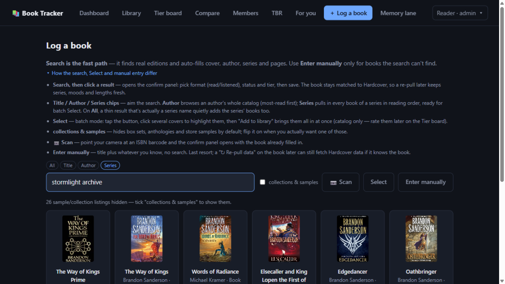

# 📖 InkHearth — Patch Notes

> New builds land here. Self-hosted — refresh the tab after an update and you're on the latest.

---

## 🧹 Update 5.9 — September 22, 2026 · "Tidy house"

Round two of the audit fixes — nothing you'll see while clicking around, but the app stops hoarding and stops trusting strangers' URLs.

- **A nightly janitor.** Expired login sessions, uploaded Kobo e-reader databases (which carry live sync credentials!) and stale temp files used to accumulate forever. They're swept twice a day now, with a 24-hour grace so nothing in active use gets touched.
- **Members can only link Audiobookshelf servers the admin sanctioned.** The "link your server" box used to fetch any URL a member typed — a window into the home network, with error details read back. It now accepts the admin's own ABS plus whatever the admin adds to `ABS_LINK_ALLOWLIST` (e.g. your own offsite shelf); anything else gets a clear "ask the admin" message. Already-linked servers sync unchanged.
- **The container no longer runs as root.** It shares a Docker network with the rest of the media stack; a compromise used to land with root privileges. One-time side effect handled on deploy: data directories chowned to the container's unprivileged user.
- **Small hardening:** the last unescaped field in the book panel is escaped, and CI now fails on any high-or-worse dependency advisory instead of nobody noticing.

---

## 🧱 Update 5.8 — September 22, 2026 · "Load-bearing"

No new buttons — the ones you already have get faster, safer, and impossible to silently break.

- **Deleting a reading entry now has an Undo.** Tap the ✕ and the entry vanishes — but for six seconds the toast offers to bring it back. The row itself is never destroyed-and-recreated, so entry order and "latest entry carries the rating" can't drift. (Closing the tab mid-countdown still sends the delete — you meant it.)
- **The dashboard hero doesn't blink anymore.** −10% / +10% / Pause redraw just the hero card: no flash, no lost scroll position, and the button keeps focus so you can tap-tap-tap through a chapter. Finish and DNF keep the full-page refresh — every number on the dashboard changes when a book ends, and that's the honest render.
- **The book panel stays put while you work in it.** Quick actions (Reading / Read / DNF / TBR / Pause / re-pull) refresh the panel in place instead of close → redraw page → reopen; the page behind catches up with one refresh when you close it.
- **The database itself now refuses duplicate books.** One card per (member, source, source-id) — enforced by a schema rule, with a one-time safety merge for any strays (there were none to merge). The friendly dedupe you see is unchanged; this is the backstop for two imports racing each other.
- **A stalled Audiobookshelf can't freeze the job queue.** Every ABS import call now has a 15-second timer and one retry — a stuck fetch becomes a warning on that one book (re-run picks it up) instead of an eternally "running" job blocking every sync behind it. Bonus fix: sync-added books actually get their Hardcover enrichment now; a missing `await` had quietly disabled it.
- **The app only listens where it's meant to.** Production publishes on loopback only — the tunnel reaches the container over the shared Docker network, so the LAN no longer gets a plain-HTTP copy of the app. Staging answers on loopback plus your `LAN_IP` (set it in `.env`) so direct `http://<LAN-IP>:3223` validation keeps working.

---

## ⏪ Update 5.7 — September 20, 2026 · "A step back"

- The dashboard's now-reading hero has a **−10%** button beside **+10%** — fat-fingered a chunk of your audiobook? Walk it back. It floors at 1% (the progress bar's lowest step); Finish, DNF and Pause are untouched.

---

## ⚖️ Update 5.6 — September 19, 2026 · "Honest numbers"

- The dashboard's **(est.)** marker explains itself — hover or long-press it for the math (pages × 275 for reads; audio minutes × 9,300 words/hour **at 1× listening speed**, so cranking playback doesn't inflate your total). The README's word-math section says the same.
- **Audiobookshelf sync never re-dates a recorded finish, period.** ABS's "last updated" is when a title was *marked finished in ABS* — meaningless as a read date for a back catalog (it briefly stamped 2026-08-16 across whole shelves). Existing finishes keep their date, their year, or their deliberate blank; only genuinely new finishes get dated.
- **Admin → Integrations** now shows per-member **Audiobookshelf link health** (last sync, errors) beside the Kobo table.
- Every push to `main` or `staging` runs the **full API smoke suite in CI** against a throwaway server — the release gate no longer depends on someone remembering to run it.

---

## 🔎 Update 5.5 — September 17, 2026 · "Who's read it?"

The Members page has a **Search the shelves** box now: type a title, author or series and see who under this roof has it — and how each of them rated it. Editions of the same work group into one row with a chip per member (avatar, tier, 📖/🎧, "reading now"), and a chip opens their profile. Nobody have it? A one-tap **log it yourself** link jumps into Log a book with your query already typed. Field chips (**All · Title · Author · Series**) narrow the hunt — same style as Log a book's search. Private shelves stay private: the search only sees members whose profile is public, plus your own.

---

## 🛡️ Update 5.4 — September 17, 2026 · "Built to last"

No flashy feature this time — an external audit of the whole app came back, and everything real it found got fixed. The app you see looks the same; it's just a lot harder to knock over.

### The library can't be taken down by one weird book anymore

Imports interrupted mid-write could leave a book's genres/moods/tags in a mangled state — and any single book like that could blank your **entire library, dashboard stats, Compare and TBR pages** with an error. Mangled cells are now skipped on read (you lose one book's tags, not the app), and a re-pull quietly rebuilds them with real metadata. Editing book details is also properly checked server-side now: an empty title or a page count of "banana" gets a clear error instead of a 500.

### Silent failures now speak up

Ever clicked a quick-status button or ✅ Save and… nothing happened, no message, nothing in the log? Those un-logged failures now show a toast saying what went wrong. Long imports (Kobo/Audible/ABS/re-pull/recommendations) also stop polling the moment you leave the page — and a job stuck for 10 minutes gives up telling you about it instead of spinning forever.

### Security hardening

- Every response now carries the standard protective headers (clickjacking, MIME-sniffing and referrer-leak protections; the barcode scanner keeps its camera).
- Behind the tunnel, the login rate-limit and login history now see **real client IPs** instead of the tunnel's.
- The offline cache wipes even when a logout *fails* — account data no longer lingers on a shared device because the logout button hit a dead network.
- Dependency audit: clean.

### Under the hood

- Series rollups, "who rates how", narrator and author averages all read on the **same 1–5 scale** now (S=5 … D=1). Series averages shift up by 1 point to match — tier letters are unchanged.
- The library shelf now loads with **one** request instead of two, over a new database index built for exactly that query.
- **Accessibility pass**: the book panel is a real dialog now (keyboard focus stays inside it, Escape closes, focus returns where you left), sortable column headers work with Tab + Enter and announce their sort direction to screen readers, and toggle buttons expose their on/off state.

---

## 🧪 Update 5.3 — September 17, 2026 · "Reading Chemistry"

**Taste match is now Reading Chemistry** — same calibrated score underneath, a new name, and it finally looks the part: the Compare headline and profile cards show a score-tinted ring gauge (red through yellow to green), and every algorithm detail is off the screen — the math stays behind the curtain where it belongs.

The name now reaches into genres too: the Compare genre table gained a **Chemistry column** — a red-to-green health bar per genre, computed by the same formula over the books you've *both* rated in that genre. Three commonly-rated books earn a bar; the bars use the undamped correlation so genuine divergence actually reads as red/orange rather than being shrunk toward the middle. Counts stay alongside.

Plus: click an **author or series name** in your library, on a member's shelf, or in the compare tables and **Log a book opens pre-aimed** — right chip (Author/Series), name in the box, results already filling in.

Fixes:

- **"Needs re-pull" that never cleared** (Road of the Patriarch): the book is Hardcover-matched with a cover, but HC's entry has no length data — and re-pulls only consulted Google Books (which *has* the page count) when HC matching failed outright. Now HC-matched books still missing lengths fall through to Google, and a migration stamps books as "checked" on every re-pull attempt so the badge stops nagging once the sources have genuinely been consulted. The bulk re-pull job no longer re-targets the same books forever.
- **0 pages / 0 hours for listens without runtimes**: text editions logged as listens (one member's whole shelf) zeroed both columns. Pages are now print-equivalent and format-agnostic (~4,800 for that shelf), and listened hours estimate from book length at narration pace (~142h) when no runtime is stored. Read books never contribute hours, and audiobooks added from search now keep their Hardcover runtime.

---

## 🎯 Update 5.2 — September 17, 2026 · "Taste, calibrated"

The match badge on member cards (and the Compare page's headline score) was the bluntest instrument in the box: the share of shared books where you both picked the *identical tier letter*. Rate everything one notch more generously than your friend and you'd score 0% while actually agreeing about every book's relative worth.

The score is now a **calibrated taste match**:

- Each rating — yours and theirs — is centered on a **half-weighted baseline**: the rater's overall average across their entire library (the same "avg rating B (3.4)" number profiles show) blended halfway with the neutral midpoint of the 1–5 scale (`0.5·μ + 1.5`). A uniformly generous rater is only half-corrected — their "A" still reads as slightly above neutral rather than below their norm — while relative-quality disagreements still count.
- The correlation runs over the books you've both rated, then gets **shrunk for sample size**: tiny overlaps stay near **50%, the no-signal midpoint**, instead of screaming 0% or 100% off three books. The final number maps onto 0–100%.
- On Compare, the headline card shows the raw correlation and the overlap alongside the percentage; the old identical-tier count moved into the Rating-deltas header ("X of Y identical tiers"). Badge threshold (≥3 commonly rated) and consent gating are unchanged.

---

## 🔍 Update 5.1 — September 17, 2026 · "Aim the search"

### Log a book: Title / Author / Series chips

Search used to mean one thing: guess-a-title. Now the Log a book page has chips — **All · Title · Author · Series**:

- **Author** browses an author's whole catalog, most-read first ("sanderson" → Mistborn, Way of Kings, Tress…), instead of whatever the fuzzy book index coughed up.
- **Series** pulls in **every book of a series in reading order**, each with series + Book N already filled in — type "stormlight archive", hit Select, tick covers, and the whole saga is in your library in one go.
- **All** got smarter too: type a series name as a plain search and the series' books quietly lead the results (the book index only has companions and "Untitled #6" placeholders for that query — the real books were always hiding behind them).

Series rosters also pick the edition people actually read (translations and dramatized split-parts lose their seat to the canonical book), box-set "bundles" join the hidden collections pile, and Author search only trusts authors your query actually names — Hardcover's author index ranks a romance novelist ahead of R. A. Salvatore for "salvatore" (their index matches book titles too), which no longer leaks through.

Member shelves get visible sort controls too: the sortable headers now show a dotted underline, the active column carries a ▼/▲ from the start instead of only after your first click — and an **Author** toggle sits beside Book, sorting by the author under the title (works on your own library's Book header as well).

The library's bulk bar gained **✅ Mark as read**: select any pile of books and give them all a finished "read" entry dated today in one go. Books already marked read are skipped, open "reading" entries close in place, TBR rows drain — and dates stay fixable afterwards with "Set year" / "Set read date unknown".

Tag cleanup, too: genres, moods and hand-made tags now uniformly start with a capital letter — everywhere they came from (Hardcover's crowd tags, Open Library subjects, imports, hand-typing). Existing tags were swept in one pass; new ones are normalized as they're written.

### 🏷 Genres got a canonical vocabulary — with Google Books as a second opinion

Hardcover's crowd genres were the only source of truth, and they're inconsistent — "Sci-Fi" vs "Science Fiction", and plenty of books tagged sparsely or oddly. Now:

- A **canonical genre vocabulary** (35 genres, seeded from this very library) decides what a genre can be called. "Sci Fi", "Sci-Fi" and "Science Fiction & Fantasy" all resolve to **Science Fiction**; genres nothing in the vocabulary knows are dropped from provider data entirely — your own hand-typed genres and tags are never touched.
- **Google Books is now a second opinion**: on every refresh, its categories are mapped through the same vocabulary and merged in whenever they know something Hardcover didn't (HC's ranking always leads).
- **Silently in the background**: a reconciler cross-checks the whole library against Google Books automatically — once shortly after this update rolls out, then on a daily clock for new adds. No refreshes required, and logging a book stays just as fast as it was.

---

## 🚀 Update 5 — September 16, 2026 · "Fix the Record"

*A week of shipping: your listening history finally tells the truth, bulk tools for everything you never wanted to click 40 times, and the app got a whole lot more social.*

---

### 🎧 Bulk read dates — fix your history in two clicks

Imports used to stamp every book with the day you imported it. Rude. Now the Library has **row checkboxes** (the header ☑ grabs everything on screen), and a bulk bar with two moves:

- **🗓 Set read date unknown** — erases the fake import-day stamp. Entries, ratings and all-time counts stay; the book just stops claiming it was finished on September 6th.
- **🗓 Set year** — type a year, hit the button, and everything selected lands in that year's stats. For the entire shelf you know you read "around 2021".

Works on finished *and* DNF entries, and it can't create duplicates — it only rewrites dates.

---

### 🙈 For books Hardcover has never heard of

Novellas and niche editions sometimes just… aren't on Hardcover. Those books used to wave the "needs re-pull" flag forever. Now a book's panel has a **No HC profile** switch (one tap right on the missing-data card, or in Edit details):

- the endless nag disappears,
- re-pulls stop wasting calls and **fall back to Google Books** for cover, pages and year instead.

*Sun Eater 1.5, this one's for you.*

---

### 👥 Reading, together

The app is a household now:

- **Avatars** — upload a profile picture; it shows everywhere you do.
- **Members page** — browse everyone's shelf, ratings-at-a-glance ("who rates generously?"), your 🎯 match % with each reader, and full profiles.
- **Reading together** — star your people and their in-progress books appear with live progress bars. See something good? **TBR it too** is one tap.
- **Compare** — consent-gated taste duels: match %, per-book rating deltas, series agreement — and you can browse each other's tier boards.

---

### ✏️ Logging got faster

- **Quick status buttons** on every book: 📌 TBR · ▶ Reading · ✅ Read · 🚫 DNF · ⏸ On pause. No forms required.
- **Edit any entry in place** (✎) — fix a date or a tier without re-entering it.
- **"Date unknown"** on the entry form swaps the date picker for an optional *year finished* — so "read it sometime in 2023" is a first-class answer.
- Accidental double-finish? Logging a re-read now asks first.

---

### 📚 Getting books in

- **Goodreads & Audible wishlist CSVs** flow straight into your TBR queue.
- Search now leans **Hardcover-first** — better covers, series and mood tags.
- **📷 Barcode scan** — point your camera at the back of a paper book, done.
- Audiobook sources unified: Audible and Audiobookshelf are one **audiobook** medium now, with room for custom sources like *graphic audio*.

---

### 🛡️ Safety nets

- **Silent nightly backups** (60 kept) + admin can roll any account back to a snapshot.
- **Download my data** — your whole library as one JSON file, whenever you want it.
- **Offline mode** — the app loads and browses without a connection.
- 🔒 A full security audit happened; everything found got fixed.

---

### 💡 Your ideas, wired in

There's a **Feature requests** page in the app — type an idea, send it, and it lands in the admin panel for triage. Genuinely: several of the features in these notes started there.

---

> 💡 **Tip — power up your own recommendations:** recommendations run fine on the shared key, but you can add **your own free Google AI Studio key** under **Account → Recommendations** (no card needed; the in-app guide walks you through it). Your For-you runs then use your quota, not the admin's.

### 🛠️ Also in this patch

- Friendlier error messages when an import job hiccups
- Library banner offers a one-tap re-pull when books are missing covers/data
- Evening finishes are dated *today*, not tomorrow (timezone fix)
- The library finally behaves on phones — pills flow, columns fold
- Admin panel: login history (with device/IP), live sessions, job status, library health
- Reading streaks 🔥 on the dashboard, moods crowd-tagged onto your books

---

*Questions, bug reports, ideas → the Feature requests page in the app.*
